# Fish_recognition

9类鱼类识别模型搭建，从网上爬取9类鱼，对爬取的数据进行数据清理等操作；搭建AlexNet等经典的分类网络，对数据集进行训练。

------


## 一、效果展示

说明：训练数据集50个epoch，其他参数不变的情况下得到如下结果：

|                    | 训练集精度 | 验证集精度 |
| ------------------ | ---------- | ---------- |
| AlexNet            | 99.47      | 82.76      |
| Googlenet          | 97.02      | 84.84      |
| VGG16              | 96.53      | 84.46      |
| MobilenetV3        | 97.06      | 85.79      |
| ShufflenetV2       | 96.77      | 85.60      |
| Resnet50(加预训练) | 100.0      | 98.29      |

**1、AlexNet**

<div align="center">  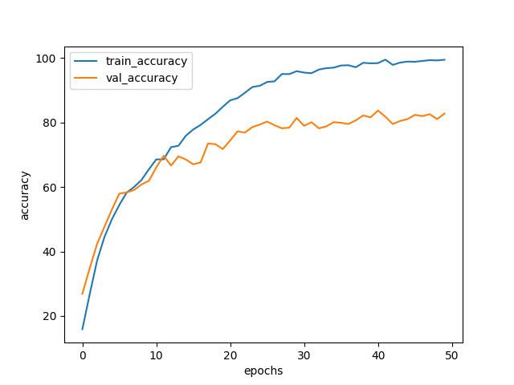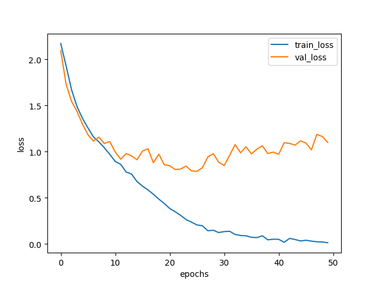 </div>

**2、Googlenet**

<div align="center">  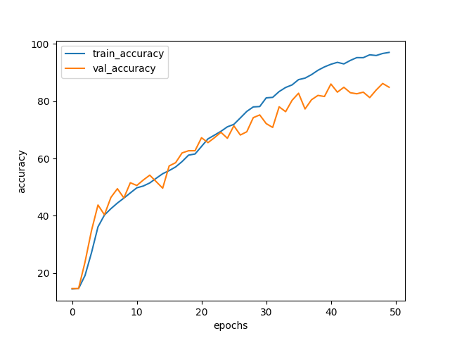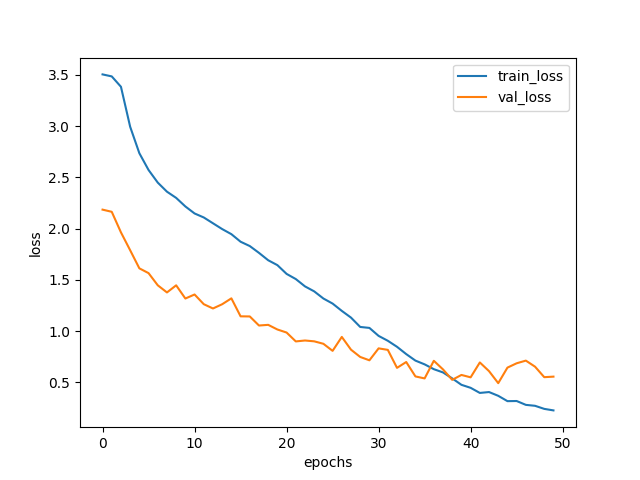 </div>

**3、VGG16**

<div align="center">  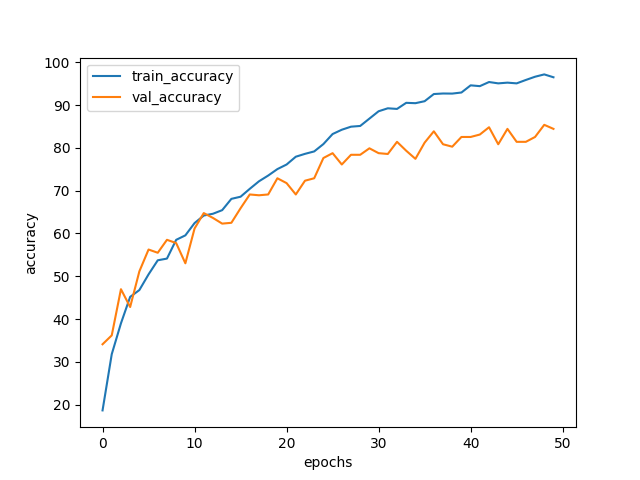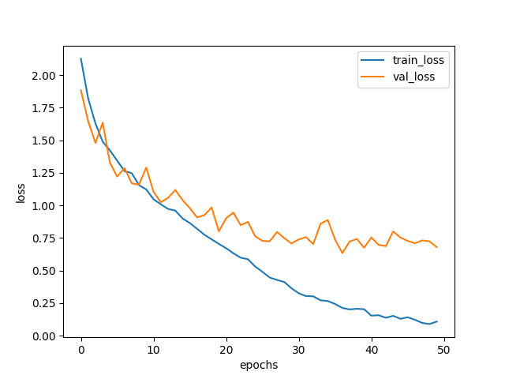 </div>

**4、Resnet50（使用了预训练权重）**

<div align="center">  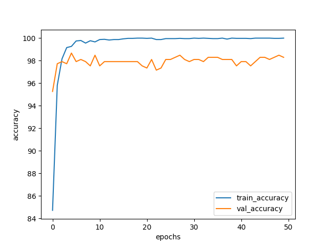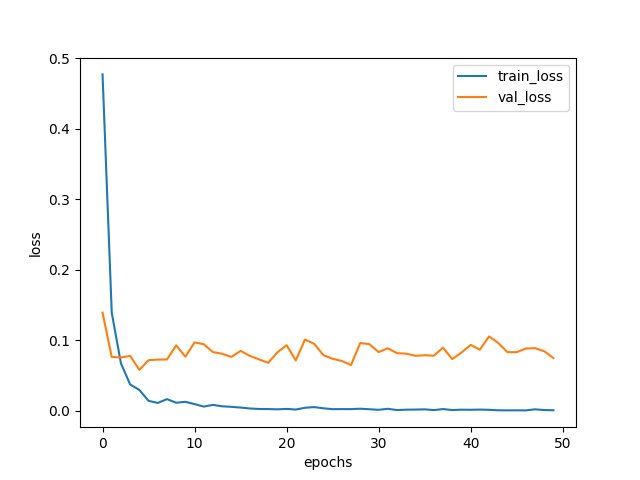 </div>

**5、MobilenetV3**

<div align="center">  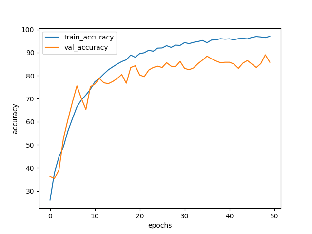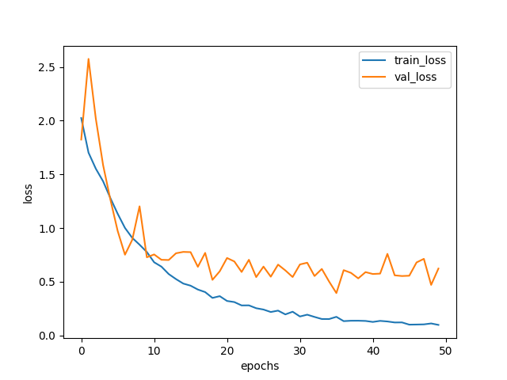 </div>

**6、ShufflenetV2**

<div align="center">  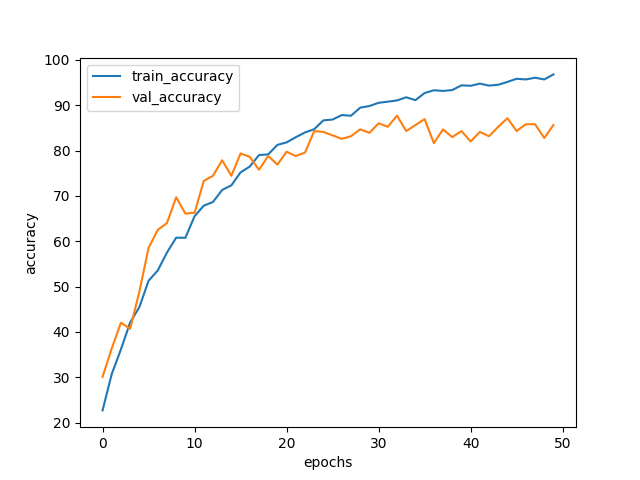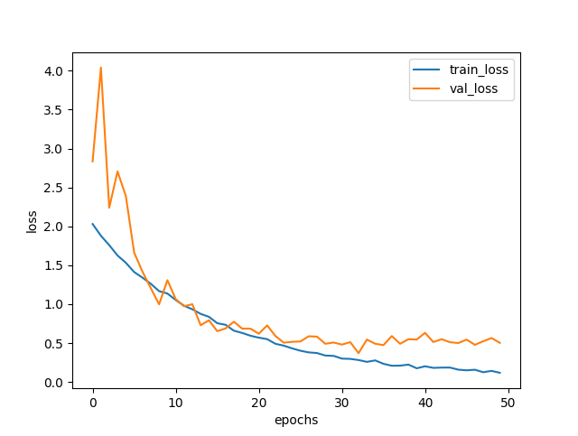 </div>

## 二、环境介绍

- 配置：tensorflow==2.11.0、Cuda 10.1
- 数据集(9类)：河豚、蝴蝶鱼、金鱼、鲫鱼、龙鱼、罗汉鱼、鲇鱼、清道夫、石板。4777张训练集, 528张验证集。

## 三、项目相关数据准备

- **鱼类数据集下载：**

  链接：https://pan.baidu.com/s/14YDm-wv5036ygL9MbRxxPg 
  提取码：jvzt

- **预训练权重下载（用于模型训练）：**

  链接：https://pan.baidu.com/s/15NhHPP08CjLl6wk8vSgZtQ 
  提取码：cewz

- **预测权重下载（用于模型预测）：**

  链接：https://pan.baidu.com/s/15hfxuz4sCEJR79S1c6a15Q 
  提取码：cipk

## 四、模型预测

> 在命令行运行：

```
python predict.py
```

> 可以通过修改predict.py里面的model_name来调用不同模型进行预测

```
# -------------------------------- 训练参数配置 --------------------------------------# 
im_height = 224 # 输入图片的高
im_width = 224  # 输入图片的宽
model_name = "AlexNet" # 模型名称"AlexNet"、"VGG"、"Googlenet","Resnet","MobilenetV3"、"Shufflenet"
img_path = r"fish_data\test\longyu.jpg" # 预测的图片
# ------------------------------------------------------------------------------------# 
```

## 五、模型训练

> 在命令行运行：

```
python train.py
```

> 可以通过修改train.py里面的model_name来调用不同模型进行训练

```
# -------------------------------- 训练参数配置 --------------------------------------# 
im_height = 224 # 输入图片的高
im_width = 224  # 输入图片的宽
num_classes = 9   # 识别的种类
batch_size = 4 # 训练的批次图片数
epochs = 50     # 训练迭代次数
model_name = "Shufflenet" # 模型名称"AlexNet"、"VGG"、"Googlenet","Resnet","MobilenetV2","MobilenetV3"、"Shufflenet"、"EfficientnetV1","EfficientnetV2"
log_draw_loss_suc = True # 是否需要通过日志绘图
# ------------------------------------------------------------------------------------# 
```

## 六、项目结构

Project:
├─checkpoints  		# 预训练权重 
├─fish_data	 		# 数据集
│  ├─fish_photos	# 完整数据集
│  ├─test			# 自己准备测试集
│  ├─train			# 划分训练集
│  └─val			# 划分验证集
├─img		             # 运行mardown显示
├─logs			      # 训练日志
├─nets                             # py模型文件
├─save_weights             # 保存训练模型文件
└─predict.py                   # 预测脚本
└─train.py                       # 训练脚本
└─split_data.py              # 数据集划分
└─Reptiles.py                 # 数据集爬取
└─class_indices.json     # 种类字典
└─requirements.txt      # 项目环境文件
